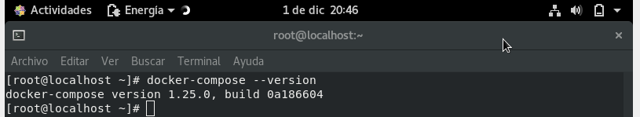

# Instalación de docker-compose en Centos

## Instamos paquete curl
`dnf install curl -y`

## Realizamos el curl

`curl -L https://github.com/docker/compose/releases/download/1.25.0/docker-compose-`uname -s`-`uname -m` -o /usr/local/bin/docker-compose`

## Damos permisos de ejecución

`chmod +x /usr/local/bin/docker-compose`

# Comprobamos que esta instalado viendo la versión

`docker-compose --version`

________________________________________
*[Volver al indice...](../README.md)*