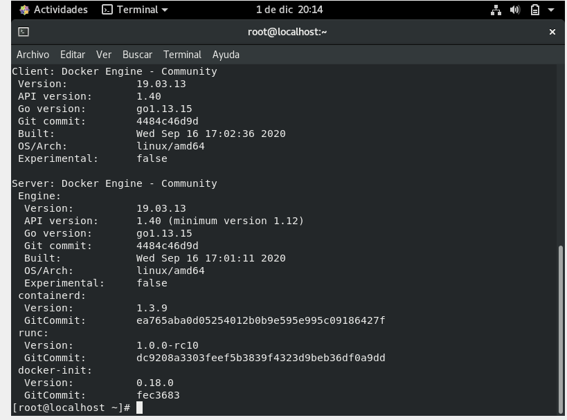

# Instalación de docker en CentOs
## Añadimos repositorios
`dnf config-manager --add-repo=https://download.docker.com/linux/centos/docker-ce.repo`

## Instalamos los paquetes de docker
`dnf install docker-ce --nobest -y`

## Iniciamos y activamos el servicio de docker
`systemctl start docker`
`systemctl enable docker`

## Vemos la versión
`docker --version`

