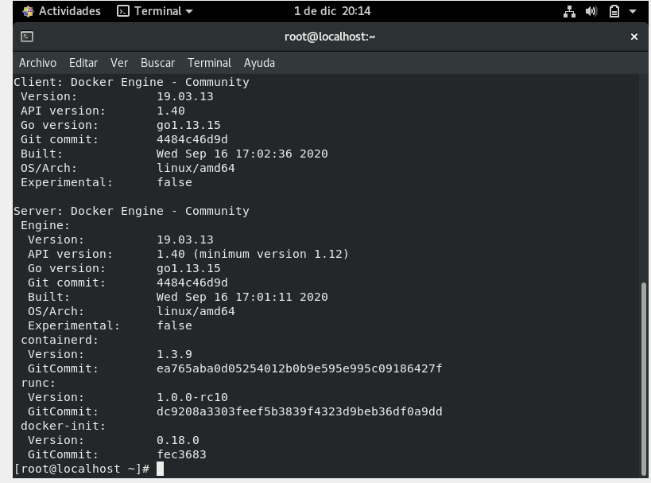
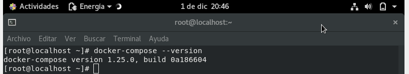

# Comprobación
## Comprobamos que esta instalado versión docker
`docker --version`

## Comprobamos que esta instalado docker-compose
`docker-compose --version`

________________________________________
*[Volver al indice...](../README.md)*